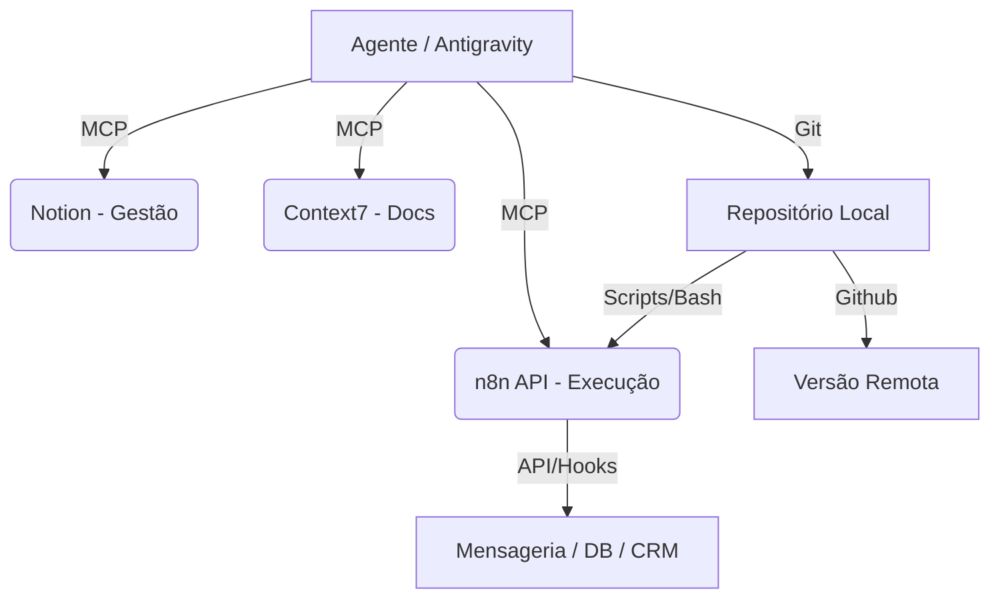

# Framework Operacional Maestro: O Sistema por Trás do Código

Este documento sistematiza a metodologia de trabalho (Framework) e a organização da infraestrutura de TI estabelecida por Diego. Ele abstrai projetos individuais para focar no **Modelo Operacional** e na **Governança de Automação**.

---

## 🏗️ Pilar I: Governança de Agentes (Protocolo La Trindade)

O "Maestro" não é apenas uma ferramenta, mas um protocolo de contenção e direcionamento para a IA (Antigravity). Ele substitui o "agir por impulso" por um processo estruturado.

### 1. Gatekeeping (Debate Multiagente)
- **Regra**: Nunca codificar imediatamente.
- **Ação**: A IA deve declarar especialistas (personas), debater a solução no chat e aguardar conformidade humana explicita. Isso garante que o desenho da solução esteja alinhado com a visão de Diego antes de qualquer linha de código ser escrita.

### 2. Efemeridade e Higiene (Diretório `.agents/`)
- **maestro_ativo**: Espaço de trabalho temporário. Cada missão gera um registro de atividades e travas (`.lock`).
- **maestro_historico**: Quando a missão termina (STATUS: CONCLUÍDO), o contexto é arquivado e o diretório ativo é destruído.
- **Benefício**: Evita a poluição de contexto e garante que cada tarefa comece em um "estado limpo".

---

## 🌐 Pilar II: Infraestrutura como Plano de Controle (MCP)

A TI não é um conjunto de abas no navegador, mas um **Plano de Controle Unificado** acessível via terminal e IA através do protocolo MCP (Model Context Protocol).

### 1. O Ecossistema de Conectores
- **n8n-mcp-server**: Integração direta com o motor de automação. Permite que a IA visualize e altere workflows em tempo real.
- **Notion MCP**: Uso do Notion como "Banco de Dados de Conhecimento" e CRM de gestão, não apenas como notas.
- **GitHub MCP**: O GitHub é o sistema de arquivos distribuído e a "Fonte da Verdade" (Single Source of Truth).
- **Context7**: O oráculo de documentação técnica.

### 2. No-Code as Code (Low-Code DevOps)
- **JSON-Centric**: Fluxos visuais são exportados como JSON para o Git.
- **Deployment Automático**: Uso de scripts bash (`sync_dev.sh`) que impõem o estado do repositório local na nuvem via chamadas de API (PUT).
- **Ambientes Isolados**: Separação física entre **Prod** (Referência), **Dev** (Evolução) e **Local** (Work-in-progress).

---

## 📚 Pilar III: Doutrina Context7 (Zero-Guesswork Engineering)

A qualidade técnica é garantida por uma barreira documental. A "intuição" da IA é secundária à "documentação oficial".

### 1. A Bússola Técnica
- **Princípio**: Não operar no escuro.
- **Fluxo Obrigatório**: `Resolve Library ID` → `Query Docs` → `Aplicação Literal`.
- **Governança**: Se a documentação não está no Context7, Diego é notificado. Isso elimina erros comuns de versões obsoletas ou parametrização incorreta de nós do n8n.

---

## ⚡ Pilar IV: Mentalidade MVP Ruptur (Agilidade de Guerrilha)

O framework de TI é desenhado para a **velocidade da validação**, não para a robustez da escala prematura.

### 1. Validação em 3 Dias
- **Objetivo**: Rodar rápido.
- **Restrição**: Não reinventar a roda, não otimizar o que ainda não provou valor (MVP).

### 2. A "Constituição" por Projeto (`.agent/rules/`)
O uso do Antigravity é customizado por projeto através de arquivos de regras na pasta `.agent/rules/`.
- **Pequenas Constituições**: Definem desde o idioma (pt-BR) até fluxos específicos de conversação da IA em cada contexto (ex: Fluxo da Alice).
- **Ativação Permanente**: Essas regras são injetadas no contexto da IA em cada turno, garantindo que o agente nunca "esqueça" as diretrizes de negócio.

---

## 🛠️ Resumo da Teia de Operação (TI)

> [!TIP]
> Este framework permite que você opere múltiplos projetos complexos (Dr. Flávio, Reginaldo, Info-produtos) com um único orquestrador de IA, mantendo a consistência e o controle de qualidade através de protocolos de governança, não de supervisão manual constante.
