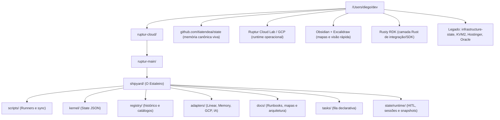

# 🗺️ Mapa do Ecossistema Ruptur

Este documento mapeia o ambiente atual a partir de `dev/` e serve como referência soberana para o **State** e para o **shipyard**.

## 🌲 Estrutura de Pastas (Hierarquia Atual)

## 📜 Instruções de Navegação para Jarvis
1.  **Sempre** assumir o `shipyard/` como a raiz de qualquer instrução de infraestrutura.
2.  **Sempre** usar o `scripts/ruptur.sh` para operações automatizadas.
3.  **Sempre** validar no `kernel/state.json` antes de iniciar uma nova manobra.
4.  **Sempre** tratar `GCP` / `Ruptur Cloud Lab` como alvo operacional atual.
5.  **Sempre** tratar `KVM2` como legado, salvo quando o histórico exigir rastreabilidade.

---
*🧬 🧠 🦾 ⌬ ∞ | J.A.R.V.I.S. — State Architecture Map — 2026-04-20*
