# Visualização do Ecossistema Ruptur

Este modelo gera os relacionamentos arquiteturais do ecossistema mapeado usando **Mermaid**. Este formato é ideal para documentação visual limpa e suportado pela importação do Excalidraw e Obsidian.

> **Instrução para Diego (Excalidraw):** 
> * Abra o site [Excalidraw.com](https://excalidraw.com/)
> * Vá no menu lateral na opção **"More tools"**, clique em **"Mermaid to Excalidraw"** (ou aperte `Ctrl/Cmd + Alt + M`)
> * Cole o código que está dentro do bloco `mermaid` abaixo.

```mermaid
graph TD
    %% Estilos Core
    classDef genesis fill:#000000,stroke:#f00,stroke-width:3px,color:#fff;
    classDef governance fill:#1a1a2e,stroke:#0f3460,stroke-width:2px,color:#fff;
    classDef lifecycle fill:#16213e,stroke:#e94560,stroke-width:2px,color:#fff;
    classDef orchestrator fill:#0f3460,stroke:#e94560,stroke-width:3px,color:#fff;
    classDef execution fill:#005e54,stroke:#128c7e,stroke-width:2px,color:#fff;
    classDef saas fill:#ff9f43,stroke:#ee5253,stroke-width:2px,color:#fff;
    classDef infra fill:#34495e,stroke:#2c3e50,stroke-width:2px,color:#fff;
    classDef wapi fill:#25D366,stroke:#128c7e,stroke-width:2px,color:#000;

    %% -------------------------------------
    %% 1. TIER DE IDENTIDADE E GOVERNANÇA
    %% -------------------------------------
    subgraph Governo e Identidade
        Alpha["alpha<br/>(Gênese, DNA Raiz)"]:::genesis
        State["state<br/>(Governança e Regras)"]:::governance
        Omega["omega<br/>(Lifecycle Sessões)"]:::lifecycle
        InfraState["infrastructure-state<br/>(Topologia IaC)"]:::infra
        VpsOracle["vps-oracle<br/>(Infra Oracle)"]:::infra
    end

    %% -------------------------------------
    %% 2. TIER ORQUESTRADOR / CONTROL PLANE
    %% -------------------------------------
    subgraph Control Plane e Motores
        Jarvis["J.A.R.V.I.S.<br/>(Maestro, Agent Loop)"]:::orchestrator
        Ruptur["ruptur<br/>(Motor Operacional, KVM2)"]:::execution
        Farm["ruptur-farm<br/>(Pool de Execução)"]:::execution
    end

    %% -------------------------------------
    %% 3. TIER DE SAAS E CLIENTES FAST
    %% -------------------------------------
    subgraph Produtos SaaS e Projetos
        WDP["will-dados-pro<br/>(Core Platform)"]:::saas
        WDPRobo["will-dados-pro-robo<br/>(BetBoom Chrome Ext)"]:::saas
        WDPMod["will-dados-pro-modular-desacoplado"]:::saas
        WDPTrain["will-dados-pro-the-training-room"]:::saas
        BetAI["plataforma-bet-ai"]:::saas
        
        RevEngine["ruptur-revenue-engine-os-ai"]:::saas
        Boost["tiatendeai-business-boost"]:::saas
        HappyMsg["happy-client-messager"]:::saas
        AutoClick["auto-click-bot"]:::execution
        Farm2DL("2dl-automated-tech-farm"):::saas
        StatusP("statuspersianas"):::saas
        Zaya("zaya"):::saas
        Bolinhas("bolinhas"):::saas
        CaboWaves("cabo-frio-waves"):::saas
        CaboEm("cabo-wave-embrace"):::saas
    end

    %% -------------------------------------
    %% 4. TIER DE AGENTES E COGNIÇÃO
    %% -------------------------------------
    subgraph Cognição e Ferramentaria
        Cognitive["ruptur-cognitive-growth-machine"]:::execution
        SelfEvol["caes-for-self-evolution-system"]:::execution
        SafeFlow["safe-flow-ia"]:::execution
        Context7["context7<br/>(Ingestão Docs)"]:::execution
        Skills["ruptur-skills"]:::execution
        Antigrav["antigravity-kit"]:::execution
        AntigravSkills["antigravity-awesome-skills"]:::execution
        Prompts["ruptur-prompts"]:::execution
        HistBruto["historicos-brutos-de-ia"]:::execution
        Whisper["connect-client-whisper"]:::execution
        SetupAi["Setup-Ai"]:::execution
        ADK["adk"]:::execution
    end

    %% -------------------------------------
    %% 5. TIER WHATSAPP E REDE
    %% -------------------------------------
    subgraph Gateways e Canais WA
        Uazapi["uazapi<br/>(Gateway WA Core)"]:::wapi
        Baileys["ruptur-baileys"]:::wapi
        WapiApp["wapi"]:::wapi
        AgentKit["whatsapp-agentkit"]:::wapi
        ZapFlow["zapflowai"]:::wapi
    end

    %% -------------------------------------
    %% LIGAÇÕES / GRAFOS DE DEPENDÊNCIA
    %% -------------------------------------
    Alpha -->|Herança| State
    State -->|Políticas| InfraState
    InfraState -->|Provisiona| VpsOracle
    State <-->|Guardrails| Jarvis
    Omega -->|Session ID| Jarvis
    
    Jarvis -->|Orquestra| Ruptur
    Jarvis -->|Delega| Farm

    Ruptur --> RevEngine
    Ruptur --> WDP
    Ruptur --> BetAI
    Ruptur --> Zaya
    Ruptur --> CaboWaves
    CaboWaves --> CaboEm

    WDPRobo -->|Cliques HW| WDP
    WDPMod -->|Componentes| WDP
    WDPTrain -->|Treinamento| WDP

    Cognitive -->|Memória| Jarvis
    Cognitive --> HistBruto
    SelfEvol --> Ruptur
    Skills -->|Plugins| Jarvis
    Antigrav -->|Kit de Sobrevivência| Jarvis
    AntigravSkills --> Antigrav
    Prompts --> Jarvis
    Context7 --> Jarvis
    Whisper -->|Audio/STT| Jarvis
    InfraState --> SetupAi
    Jarvis -->|Agent Base| ADK

    Uazapi -->|Trilha Eventos| Jarvis
    Baileys -->|Protocolo| Uazapi
    WapiApp -->|Wrappers| Uazapi
    AgentKit -->|Toolkit WA| Uazapi
    ZapFlow -->|Fluxos UI| Uazapi

    Farm -->|Geração Receita| Farm2DL
    Farm -->|RPA| AutoClick
    RevEngine --> HappyMsg
    RevEngine --> Boost

    %% Relacionamentos visuais dispersos pontilhados
    WDP -.-> Gilded[ruptur-gilded-dream-styles]
    Ruptur -.-> WarpApp[ruptur-environment-oz-warp-app]
    SafeFlow -.-> Jarvis
    Bolinhas -.-> Ruptur

```

